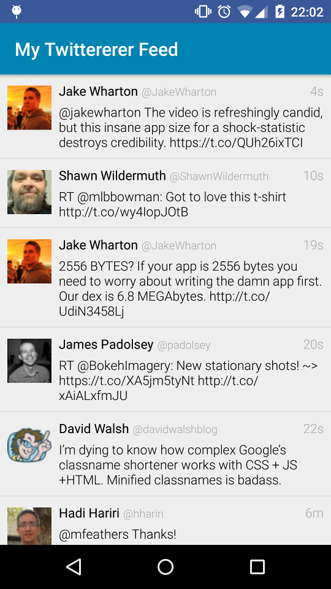

# Twittererer

A simplistic Android Twitter client demonstrating the use of the MVP pattern, unit tests with pure JUnit4 and Robolectric, UI testing using UI Automator and Espresso, usage of various libraries such as Dagger 2, RxJava, Retrofit, Twitter SDK, RecyclerView, Butter Knife, Picasso, Joda-Time, etc

## Functionality
- Log in with Twitter
- View last 20 tweets on home timeline
- Pull to refresh
- Post tweet

## Architecture

The project uses the MVP pattern for clear separation of concerns and to maximise testability

### Models

Simple model classes to represent the relevant information for the app

### Presenters

The only presenter for now is the [TimelinePresenter](https://github.com/zfoltin/twittererer/blob/master/app/src/main/java/com/crowdmix/twittererer/presenters/TimelinePresenter.java), responsible to manage data loading/saving, update the view and handle user interaction events

### Services

[TwitterService](https://github.com/zfoltin/twittererer/blob/master/app/src/main/java/com/crowdmix/twittererer/services/TwitterService.java) handles communication with the [Twitter API](https://dev.twitter.com/rest/public)

Here the callback interfaces have been converted to RxJava Observables and the Twitter SDK objects converted to our models

### UI

All UI related classes live here

- Activities

- Adapters

### Utils

[TimelineConverter](https://github.com/zfoltin/twittererer/blob/master/app/src/main/java/com/crowdmix/twittererer/utils/TimelineConverter.java) converts from cumbersome Tweets to our [TimelineItem](https://github.com/zfoltin/twittererer/blob/master/app/src/main/java/com/crowdmix/twittererer/models/TimelineItem.java) models

### Views

View interfaces implemented by Activities

----

## Testing on Android

The project demonstrates different testing techniques

- Simple JUnit4 tests are used to test presenters - [TimelinePresenterTest.java](https://github.com/zfoltin/twittererer/blob/master/app/src/test/java/com/crowdmix/twittererer/presenters/TimelinePresenterTest.java)

- Robolectric is used when Android framework classes are required - [TimelineConverter.java](https://github.com/zfoltin/twittererer/blob/master/app/src/test/java/com/crowdmix/twittererer/utils/TimelineConverterTest.java)

- UI Automator is used when UI tests need to interact with activities outside the app - [LoginActivityTest](https://github.com/zfoltin/twittererer/blob/master/app/src/androidTest/java/com/crowdmix/twittererer/ui/activities/LoginActivityTest.java)

- Espresso is used when only interacting with activities of the app - [TimelineActivityTest](https://github.com/zfoltin/twittererer/blob/master/app/src/androidTest/java/com/crowdmix/twittererer/ui/activities/TimelineActivityTest.java)

----

## The wonderful libraries that made everything jolly-good

Not in any particular order

- [Dagger 2](http://google.github.io/dagger/)
- [RxJava](https://github.com/ReactiveX/RxJava)
- [RxAndroid](https://github.com/ReactiveX/RxAndroid)
- [Retrolambda](https://github.com/evant/gradle-retrolambda)
- [Project Lombok](https://projectlombok.org/)
- [Retrofit](http://square.github.io/retrofit/)
- [OKHttp](http://square.github.io/okhttp/)
- [Butter Knife](http://jakewharton.github.io/butterknife/)
- [Picasso](http://square.github.io/picasso/)
- [Joda-Time](http://www.joda.org/joda-time/)
- [JUnit](http://junit.org/)
- [Mockito](http://mockito.org/)
- [Hamcrest](http://hamcrest.org/)
- [Robolectric](http://robolectric.org/)
- [Espresso](https://developer.android.com/tools/testing-support-library/index.html#Espresso)
- [UI Automator](https://developer.android.com/tools/testing-support-library/index.html#UIAutomator)

Special thanks to Twitter for [Fabric](https://fabric.io)
